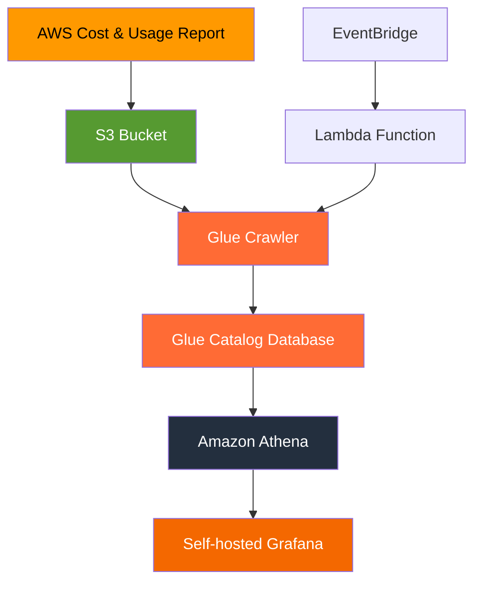

# AWS Cost and Usage Report Dashboard - FinOps Solution

[](https://aws.amazon.com/)
[](https://www.terraform.io/)
[](https://grafana.com/)
[](https://aws.amazon.com/athena/)

A complete **FinOps solution** for AWS cost monitoring using Cost and Usage Reports (CUR), Amazon Athena, and self-hosted Grafana dashboards. Built with Infrastructure as Code using Terraform.

## 🎯 What This Solution Provides

**Cloud Cost Visibility & Optimization** - Get detailed insights into your AWS spending patterns, identify cost-saving opportunities, and create beautiful dashboards for FinOps reporting.

### Key Features

- 📊 **Automated CUR Processing** - Daily cost and usage reports delivered to S3
- 🔍 **Advanced Analytics** - Pre-built SQL queries for cost analysis by service, account, region, and tags
- 📈 **Real-time Dashboards** - Self-hosted Grafana with cost visualization
- 🚀 **Infrastructure as Code** - Complete Terraform setup for production deployments
- 🔒 **Security First** - Least-privilege IAM roles and encrypted data storage
- 📋 **Multi-environment Support** - Dev, staging, and production configurations

## 🏗️ Architecture Overview



### Data Flow

1. **AWS CUR** generates detailed cost reports daily
2. **S3** stores Parquet files securely with encryption
3. **Glue Crawler** automatically catalogs new data
4. **Athena** enables SQL queries on cost data
5. **Grafana** provides beautiful visualizations
6. **EventBridge + Lambda** automate data processing

## 🚀 Quick Start Guide

### Prerequisites

- AWS CLI configured with appropriate permissions
- Terraform >= 1.0 installed
- AWS account with billing access
- (Optional) AWS Organizations for multi-account analysis

### Step 1: Clone and Setup

```bash
# Clone the repository
git clone https://github.com/vicoftech/billing_aws_finops_dashboard.git
cd billing_aws_finops_dashboard

# Configure AWS credentials
./scripts/fix-aws-creds.ps1  # PowerShell
# or
./scripts/fix-aws-creds.sh   # Bash
```

### Step 2: Deploy Infrastructure

```bash
# Navigate to infrastructure directory
cd infrastructure

# Initialize Terraform
terraform init

# Review the plan
terraform plan -var-file="dev.tfvars"

# Deploy to AWS
terraform apply -var-file="dev.tfvars" -auto-approve
```

### Step 3: Access Your Dashboard

```bash
# Get dashboard URLs
terraform output grafana_url
terraform output grafana_ssh_private_key

# Example output:
# grafana_url = "http://34.195.80.241"
```

### Step 4: Run Cost Analysis Queries

Open AWS Athena console and run queries from `examples/sample-queries.sql`:

```sql
-- Top 10 most expensive services this month
SELECT
    line_item_product_code,
    line_item_usage_type,
    SUM(line_item_blended_cost) as total_cost,
    COUNT(*) as line_items
FROM cur_report
WHERE billing_period = (
    SELECT MAX(billing_period)
    FROM cur_report
)
GROUP BY line_item_product_code, line_item_usage_type
ORDER BY total_cost DESC
LIMIT 10;
```

## 📊 Cost Analysis Capabilities

### Pre-built Queries Include:

#### 💰 Cost by Account
- Compare spending across AWS accounts
- Identify which accounts drive the most costs
- Track cost allocation for chargebacks

#### 🏷️ Cost by Service
- Top spending services and products
- Usage patterns and trends
- Cost optimization opportunities

#### 🌍 Cost by Region
- Geographic cost distribution
- Cross-region efficiency analysis
- Data transfer cost insights

#### 🏷️ Cost by Tags
- Business unit cost attribution
- Project-based cost tracking
- Environment-specific analysis

#### 📈 Advanced Analytics
- Daily spending trends
- Savings Plan utilization
- Reserved Instance optimization
- Cost anomaly detection

## 🔧 Configuration Files

### Environment Variables

| File | Purpose | When to Use |
|------|---------|-------------|
| `dev.tfvars` | Development environment | Testing and development |
| `staging.tfvars` | Staging environment | Pre-production validation |
| `prod.tfvars` | Production environment | Live FinOps monitoring |

### AWS Profiles

Configure multiple AWS profiles for different environments:

```bash
# ~/.aws/credentials
[bsj_dev]
aws_access_key_id = YOUR_ACCESS_KEY
aws_secret_access_key = YOUR_SECRET_KEY
region = us-east-1

[bsj_prod]
aws_access_key_id = YOUR_ACCESS_KEY
aws_secret_access_key = YOUR_SECRET_KEY
region = us-east-1
```

## 📈 Dashboard Examples

### Cost Overview Dashboard


### Service Cost Breakdown
- Pie charts showing service distribution
- Time series for cost trends
- Cost comparison across accounts

### Savings Opportunities
- Underutilized resource identification
- Reserved Instance recommendations
- Savings Plan optimization alerts

## 🔒 Security & Best Practices

### IAM Permissions
The solution follows least-privilege principles with dedicated roles for:

- **Glue Crawler**: Read-only S3 access + Glue permissions
- **Lambda Function**: Glue start/stop permissions only
- **S3 Bucket**: Encrypted storage with access logging

### Data Protection
- **Encryption at Rest**: AES-256 encryption for all data
- **Access Control**: Bucket policies restrict access to authorized roles
- **Audit Logging**: CloudTrail integration for compliance

### Cost Optimization
- **Serverless Architecture**: Pay only for actual usage
- **Auto-scaling**: Resources scale based on demand
- **Resource Tagging**: Comprehensive tagging for cost allocation

## 🛠️ Troubleshooting

### Common Issues

#### CUR Files Not Appearing
```bash
# Check CUR status
aws cur describe-report-definitions --profile bsj_dev

# Verify S3 bucket
aws s3 ls s3://your-bucket/cur-reports-v2/ --profile bsj_dev
```

#### Athena Query Errors
```bash
# Check Glue table schema
aws glue get-table \
  --database-name billing-dashboard_dev_billing \
  --name cur_report \
  --profile bsj_dev
```

#### Grafana Connection Issues
```bash
# Verify EC2 instance status
aws ec2 describe-instances \
  --instance-ids $(terraform output -raw grafana_instance_id) \
  --profile bsj_dev
```

### Getting Help

1. Check the [troubleshooting guide](docs/TROUBLESHOOTING.md)
2. Review AWS service limits and quotas
3. Verify IAM permissions are correctly configured
4. Check CloudWatch logs for detailed error messages

## 📚 Documentation

- **[Architecture Guide](docs/ARCHITECTURE.md)** - Deep dive into system design
- **[FinOps Best Practices](docs/FINOPS_GUIDE.md)** - Cost optimization strategies
- **[IAM Permissions](docs/IAM_PERMISSIONS.md)** - Required AWS permissions
- **[Terraform State](docs/TERRAFORM_STATE.md)** - State management guide

## 🤝 Contributing

We welcome contributions! Please see our [Contributing Guide](CONTRIBUTING.md) for details.

### Development Setup

```bash
# Fork and clone
git clone https://github.com/your-username/billing_aws_finops_dashboard.git
cd billing_aws_finops_dashboard

# Create feature branch
git checkout -b feature/amazing-improvement

# Make changes and test
terraform plan -var-file="dev.tfvars"

# Submit pull request
git push origin feature/amazing-improvement
```

## 📄 License

This project is licensed under the MIT License - see the [LICENSE](LICENSE) file for details.

## 🙏 Acknowledgments

- AWS Cost and Usage Report team for comprehensive billing data
- HashiCorp Terraform for infrastructure automation
- Grafana Labs for beautiful data visualization
- FinOps Foundation for cost management best practices

## 📞 Support

- **Issues**: [GitHub Issues](https://github.com/vicoftech/billing_aws_finops_dashboard/issues)
- **Discussions**: [GitHub Discussions](https://github.com/vicoftech/billing_aws_finops_dashboard/discussions)
- **Email**: For enterprise support inquiries

---

**Built with ❤️ for the FinOps community**

**Optimize cloud costs, maximize business value** ☁️💰📊

---

*Keywords: AWS, FinOps, Cost Optimization, Cloud Financial Management, Terraform, Grafana, Athena, Cost and Usage Report, Cloud Cost Monitoring*